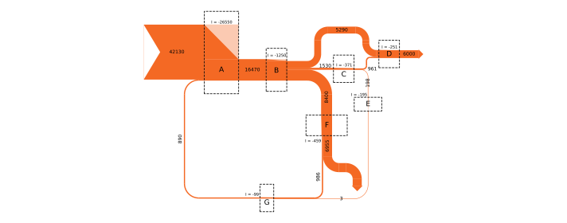

# ExergyFlow

Grassmann/Sankey diagrams for energy and exergy analysis



## Install
```bash
python -m pip install exergyflow
```

## Quickstart
```python
from exergyflow import Diagram, DiagramConfig, RouteSegment
d = Diagram(DiagramConfig(auto_scale=True, auto_scale_target=1.0))
d.add_process("P1")
d.add_flow("F1", 10, source=None, target="P1")
d.add_flow("F2", 5, source="P1", target=None)
route1 = [RouteSegment(kind='rect', length=0.25, direction='right'),
          RouteSegment(kind='elbow', length=0.25, turn='rightup'),
          RouteSegment(kind='rect', length=0.5, direction='up')]
d.add_flow("F3", 2, source="P1", target=None, route=route1)
fig, ax = d.draw()
fig.savefig("diagram.png", dpi=300, bbox_inches="tight")
```

## Real engineering example
A simplified Brayton flow sketch (values illustrative):
```python
from exergyflow import Diagram, DiagramConfig, RouteSegment

cfg = DiagramConfig(flow_value_unit="kW", flow_value_format=".0f",
                    auto_scale=True, auto_scale_target=2.0)
d = Diagram(cfg)

# Processes
d.add_process("Compressor", direction="up", length=2.5,
              label_rotation=90, color="#59a2d3")
d.add_process("Combustor", direction="right", length=2.5, color="#59a2d3")
d.add_process("Turbine", direction="down", label_rotation=-90, color="#59a2d3")

# Routes
route_work_out = [
    RouteSegment(kind='rect', length=0.25, direction='down'),
    RouteSegment(kind='elbow', length=0.5, turn='downright'),
    RouteSegment(kind='rect', length=2.5, direction='right')
]
route_exhaust = [
    RouteSegment(kind='rect', length=1.5, direction='down'),
    RouteSegment(kind='elbow', length=0.5, turn='downright'),
    RouteSegment(kind='rect', length=2.6, direction='right')
]
route_air = [
    RouteSegment(kind='rect', length=3.5, direction='right'),
    RouteSegment(kind='elbow', length=0.5, turn='rightup'),
    RouteSegment(kind='rect', length=0.5, direction='up')
]

# Flows
d.add_flow("Work_out", 220, source="Turbine",
           target=None, label="W_t", route=route_work_out)
d.add_flow("Exhaust", 180, source="Turbine", target=None,
           label="E_exh", route=route_exhaust)
d.add_flow("Work_in", 80, source="Turbine",
           target="Compressor", label="W_c", cycle_breaker=True, label_dy=-0.3)
d.add_flow("Air", 280, source=None,
           target="Compressor", label="E_air", route=route_air)
d.add_flow("Compressed", 300, source="Compressor",
           target="Combustor", label="E_2", label_dy=0.2)
d.add_flow("Fuel", 700, source=None,
           target="Combustor", length=7.75, label="E_f")
d.add_flow("Hot_gas", 560, source="Combustor",
           target="Turbine", label="E_3", label_dy=0.2)
fig, ax = d.draw()
fig.savefig("brayton.svg", dpi=300, bbox_inches="tight")
```

## Advantages
- Built for thermodynamic energy and exergy conventions, including imbalance triangles and process-aware flow direction rules.
- Auto-layout for fast drafts, manual routing for publication-grade control.
- Matplotlib-native output for crisp vector export (SVG/PDF) without extra tooling.
- Deterministic layout and explicit routing rules help reproduce figures consistently.
- Built-in unit formatting for labels keeps diagrams engineering-ready.

## Details
- Supported Python versions: 3.9–3.14 (see `pyproject.toml`).
- `flow_label_mode` options: `name_value_units` (default), `value_units`, `value_only`.
- Units formatting: `flow_value_unit`, `flow_value_format`, `flow_value_unit_sep`.
- Auto-layout expects a DAG; use `cycle_breaker=True` on a process→process flow to break cycles.
- Manual routing must alternate `rect` and `elbow` segments and start/end with `rect`.
- Matplotlib-native output: export PNG, SVG, or PDF via `fig.savefig(...)`.

## Docs
- [Step-by-step guide](docs/STEP_BY_STEP.md)
- [Cheatsheet](docs/CHEATSHEET.md)

## Adavanced example
For an advanced example see: [Example script](examples/grassmann_example.py)
